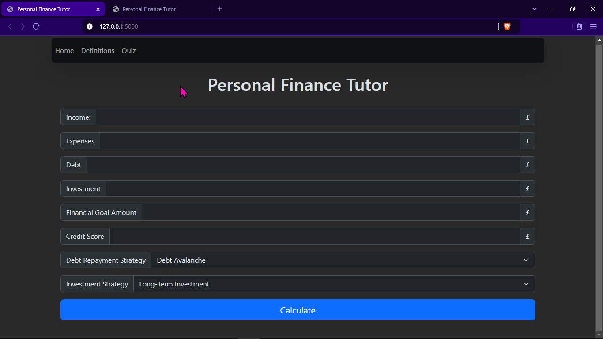
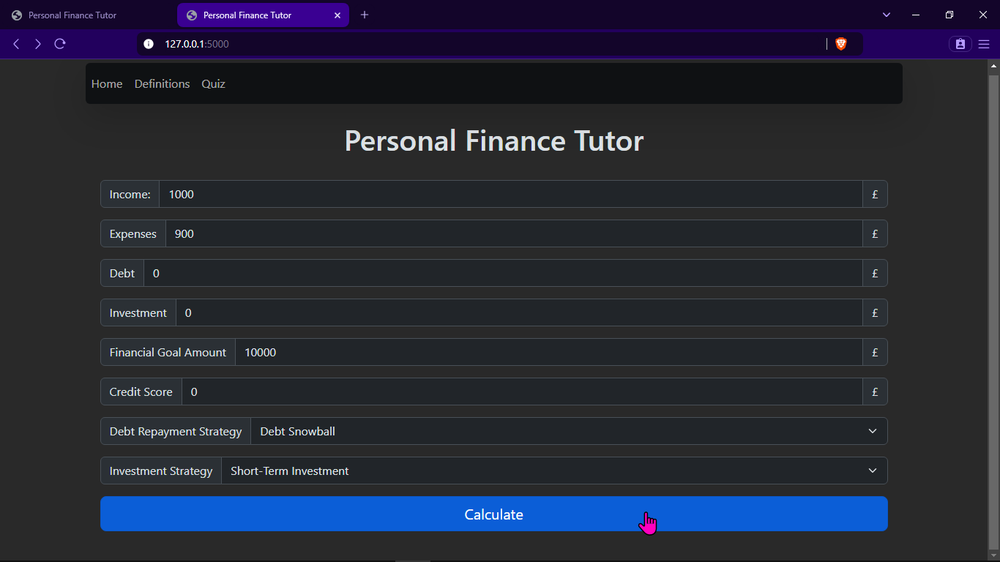
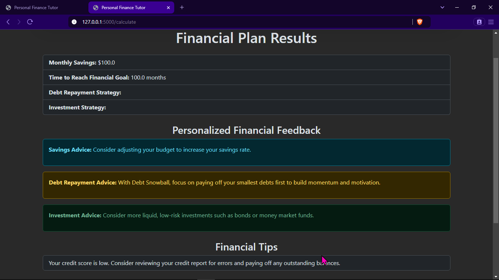
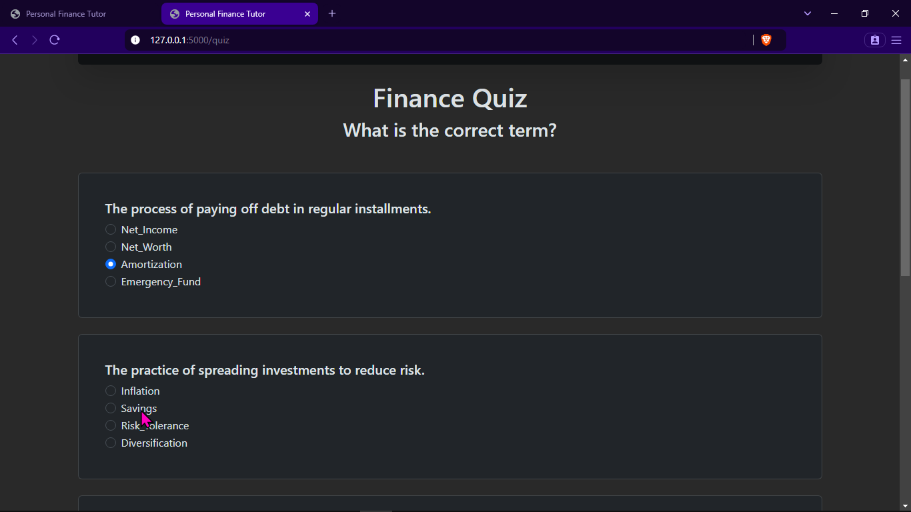
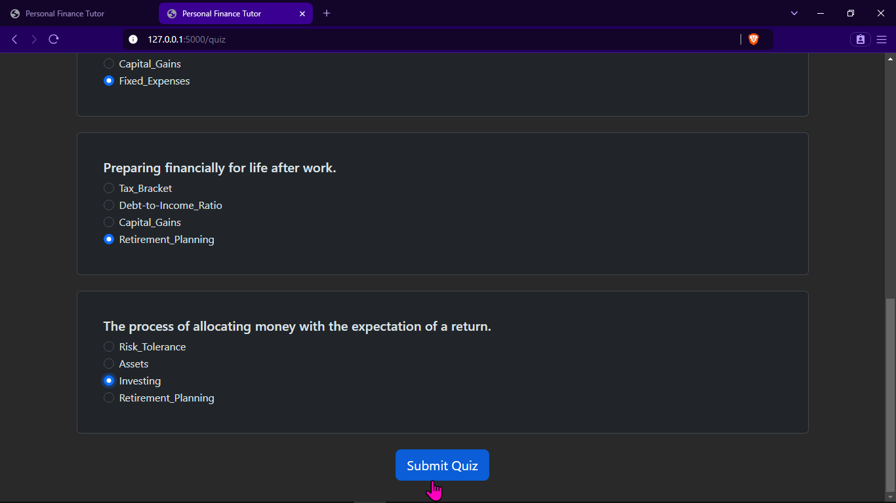
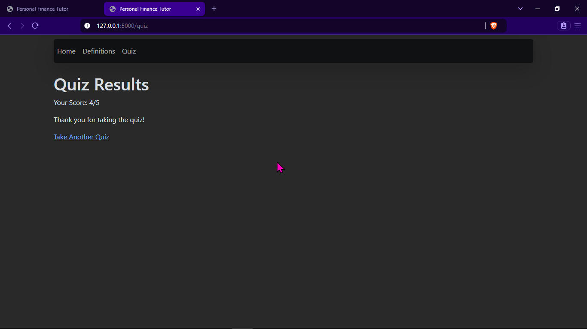
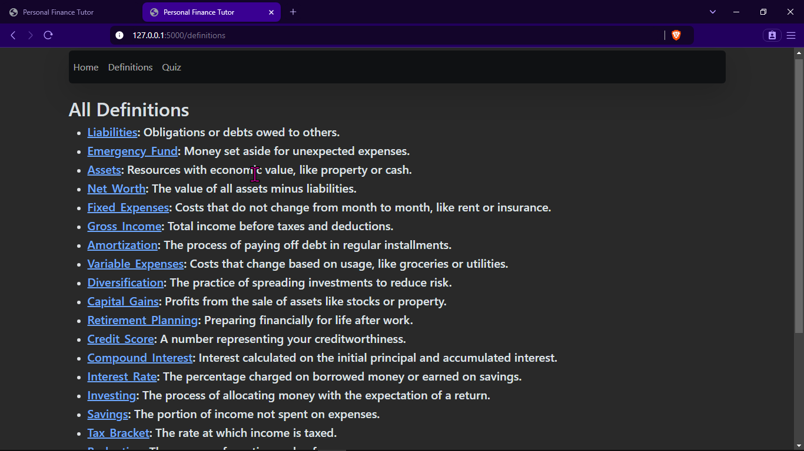

# Personal Financial Tutor With Python

## Technologies used

- [Protégé (Ontology Editor) ](https://protege.stanford.edu/)
- [Flask (Python web framework)](https://flask.palletsprojects.com/en/stable/)
- [Bootstrap (UI)](https://getbootstrap.com/docs/5.3/getting-started/introduction/)
- [RDFlib (Working with Resource Description Framework)](https://rdflib.readthedocs.io/en/stable/)

## How to Start the Personal Financial Tutor

1. **Install Required Packages:**

   ```bash
   pip install flask rdflib
   ```

2. **Run the Flask Application:**

   ```bash
   python app.py
   ```

3. **Access the Application:**
   Open a web browser and go to `http://127.0.0.1:5000/` to start using the Personal Financial Tutor.

## Demo and Screenshotss





### Quiz Page





### Definition Page


